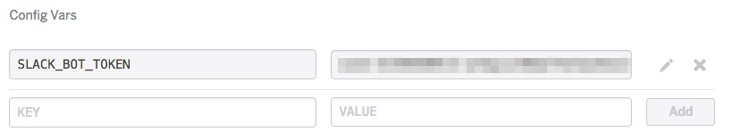

## PyBot on Heroku

#### What is this?

A Python bot for a [Slack](https://slack.com/) group. It uses the [Python slack client](https://github.com/slackhq/python-slackclient) which is a Python wrapper for the Slack API.

#### Useful Links

* [Heroku: Configuration and Config Vars](https://devcenter.heroku.com/articles/config-vars#setting-up-config-vars-for-a-deployed-application)
* [Slack API](https://api.slack.com/)
* [How to Build Your First Slack Bot With Python](https://www.fullstackpython.com/blog/build-first-slack-bot-python.html) -- Tutorial the original skeleton of this bot is based on (pre customization)
* [Python docs: .format & comma as thousands separator](https://docs.python.org/3/library/string.html#format-specification-mini-language)
* [Python virtual environments: virtualenv](http://docs.python-guide.org/en/latest/dev/virtualenvs/#virtualenv) - *"virtualenv is a tool to create isolated Python environments"*
* [Slack API: unfurling (previews)](https://api.slack.com/docs/message-attachments#unfurling)

### Pushing Updates to Heroku

* You must added as a *Collaborator* in the Heroku app config to push updates to the app. 
* Download and install the [Heroku Toolbelt](https://toolbelt.heroku.com/).

Login to Heroku:  
`$ heroku login`

Add the application ([Creating a Heroku remote](https://devcenter.heroku.com/articles/git#creating-a-heroku-remote)):  
`$ heroku git:remote -a pybot-cupway`

Deploy code:  
`$ git push heroku master`

#### Troubleshooting

After pushing, ensure `@pybot` is still *green* in the DMs list (he's online 24/7):  


___

If `@pybot` shows offline after pushing to Heroku, there is probably an error in the Python code. Check the Heroku logs: `$ heroku logs`

___

Sometimes after deploying code, the dyno may stop. Start the dyno again after a `git push heroku master` update to Heroku:  

```
$ heroku ps
Free dyno hours quota remaining this month: 550h 0m (100%)
For more information on dyno sleeping and how to upgrade, see:
https://devcenter.heroku.com/articles/dyno-sleeping

No dynos on ⬢ pybot-cupway
```

That indicates no dyno running. Let's start it:


```
$ heroku ps:scale worker=1
Scaling dynos... done, now running worker at 1:Free
(venv) 

$ heroku ps
Free dyno hours quota remaining this month: 550h 0m (100%)
For more information on dyno sleeping and how to upgrade, see:
https://devcenter.heroku.com/articles/dyno-sleeping

=== worker (Free): python pybot.py (1)
worker.1: up 2016/06/18 23:16:17 -0600 (~ 3s ago)
```
___

Display running Heroku processes:  
`$ heroku ps`

Check Heroku logs (get last 50 lines):  
`$ heroku logs -n 50`

### Heroku Configuration Notes

In [Heroku Settings](https://dashboard.heroku.com/apps/pybot-cupway/settings), `SLACK_BOT_TOKEN` has to be set as a configuration variable:



___

A [`requirements.txt`](https://github.com/cupway/pybot-cupway/blob/master/requirements.txt) file must be in the repo, and it has to reference the Python `slackclient` module.


### Local Dev (Non Heroku)

If we've removed the bot from Heroku, or stopped the `worker` Dyno it's running under and want to test locally, the code is set to pull the bot token from a (per console session) environment variable. 

Set environment variables:  
`$ export SLACK_BOT_TOKEN="put generated token here"`


If using a virtualenv for local Python dev

Install the slack client in the virtualenv:  
`$ pip install slackclient`

Activate the virtualenv for development:  
`$ source bin/activate`


